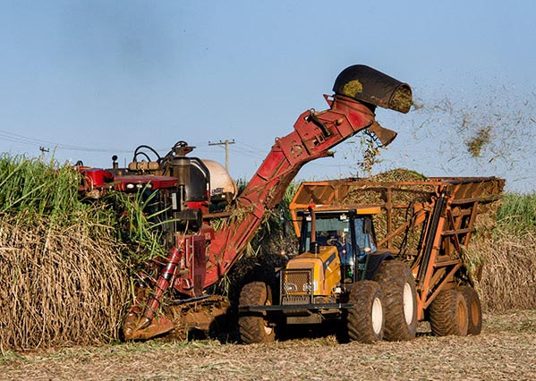

# :black_medium_square: Hidráulica Geral - FA676 :black_medium_square:

    

- [x] Parte 1
    * Sistemas de Unidades
            <table>
            <thead>
              <tr>
                <th>Grandeza</th>
                <th>SI</th>
                <th>CGS</th>
                <th>ST</th>
              </tr>
            </thead>
            <tbody>
              <tr>
                <td>Massa</td>
                <td>kg</td>
                <td>g</td>
                <td>utm</td>
              </tr>
              <tr>
                <td>Comprimento</td>
                <td>m</td>
                <td>cm</td>
                <td>m</td>
              </tr>
              <tr>
                <td>Tempo </td>
                <td>s</td>
                <td>s</td>
                <td>s</td>
              </tr>
              <tr>
                <td>Força</td>
                <td>N</td>
                <td>dina</td>
                <td>kgf</td>
              </tr>
            </tbody>
            </table>
        * Sistemas MLT (Mass, Length, Time)
            * Sistema Internacional (SI)
            * Sistema CGS (Centimeter, Gram, Second)
        * Sistemas FLT
            * Sistema técnico
    
    * Propriedades físicas da água
        * Massa específica
        * Peso específico
        * Densidade
        * Viscosidade
        * Compressibilidade
        * Tensão superficial
        * Capilaridade
        * Pressão de vapor
    * Hidrostática
        * Lei de Stevin
        * Pressão relativa e absoluta
        * Instrumentos de medição de pressão
- [x] Parte 2
    * Hidrodinâmica
        * Equação da continuidade
        * Equação de Bernoulli
            * Perda de carga
            * Bomba
                * Incremento de energia no escoamento
            * Turbina
                * Decremento de energia no escoamento
            * Tubo Venturi
                * Empregado para medição de vazão em condutos pressurizados. É comum encontrar um manômetro diferencial acoplado ao longo de seu comprimento. Por meio da deflexão manométrica presente nos capilares é possível estimar a vazão do fluido em questão.
- [ ] Parte 3
    * Orifícios
- [ ] Parte 4
    * Bocais e tubos curtos
- [ ] Parte 5
    * Condutos forçados